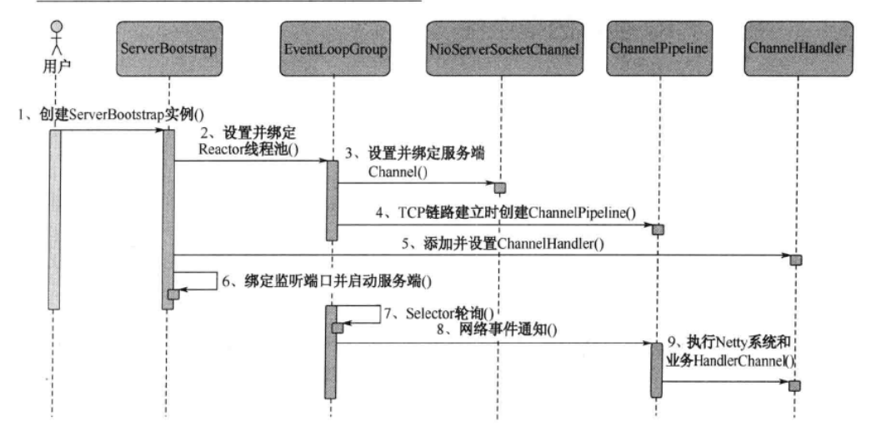

### Netty服务创建时时序图

	### 步骤1：

​	创建ServerBootstrap实例。它是Netty服务端启动辅助类，提供了一系列的方法用于设置服务端启动的相关参数。底层通过门面模式对各种能力进行抽象和封装，这些做是让我们不需要跟过多的底层API打交道。

#### 步骤2：

​	设置绑定Reactor线程池。Netty的Reactor线程池是EventLoopGroup，它实际就是EventLoop的数组。EventLoop的职责是处理所有注册到本线程多路复用器Selector上Channel，Selector的轮询操作由绑定的EventLoop线程run方法驱动，在一个循环体内循环执行。而EventLoop的职责不仅仅是处理网络I/O事件，自定义的Task和定时任务Task也统一由EventLoop负责处理，这样线程模型就实现了统一。从调度层面看，也不存在从EventLoop线程中再启动其他类型的线程用于异步执行另外的任务，这样就避免了多线程并发操作和锁的竞争，提升了I/O线程的处理和调度性能。

#### 步骤3

设置并绑定服务端Channel。作为NIO服务端，需要创建ServerSocketChannel，Netty对原生的NIO类库进行了封装，对应实现是NioServerSocketChannel，对于用户而言，不需要关心服务端Channel的底层实现细节和工作原理，只需要指定具体使用哪种服务端Channel即可。

