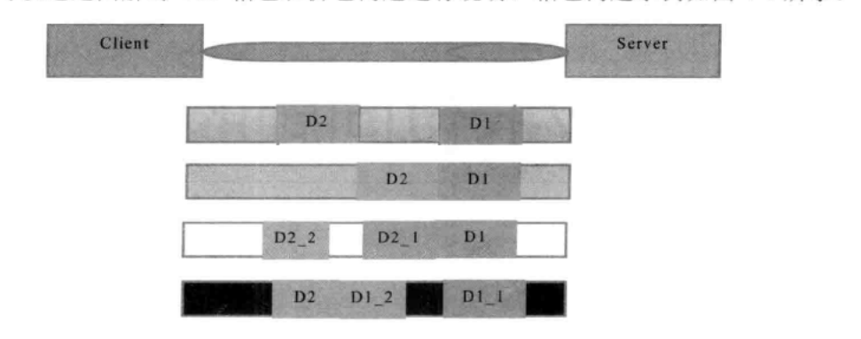

#### 一、介绍

​          TCP是个流协议，所谓流，就是没有界限的一串数据。可以想想河里的流水，他们是连练成一片的，其间并没有分界线。TCP底层并不了解上层业务数据的具体含义，他会根据TCP缓冲区的实际情况进行包的划分，所以在业务上认为，一个完整的包可能会被TCP拆分成多个包进行发送，也有可能把多个小的包封装成一个打的数据包发送，这就是所谓的TCP沾包和拆包的问题。

#### 二、TCP粘包/拆包问题说明

   假设客户端分别发送两个数据包D1和D2给服务端，由于服务端一次读取到的字节数不确定的，故可能存在以下4种情况

- 服务端分两次读取到了两个独立的数据包，分别是D1和D2，没有粘包和拆包
- 服务端一次接受到了两个数据包，D1和D2粘合在一起，被称为TCP粘包
- 服务端分两次读取到了两个数据包，第一次读取到了完成的D1包和D2部分包的内容，第二次读取到了D2包剩余的内容，这被称为TCP拆包
- 服务端分两次读取到了两个数据包，第一次读取到D1包的部分包D1_1，第二次读取到了D1包剩下的D1_2和D2的完整包，这也被称为拆包

​      如果此时服务端TCP接受区非常小，而数据包D1和D2比较大，接受区可能放不下，很有可能第五种可能，即服务区分多次才能将两个完整的包接收，期间发生多次拆包。

#### 三、TCP粘包/拆包发生的原因分析

- 1、应用程序write写入的字节大小大于套接口发送缓冲区大小
- 2、进行MSS大小的TCP分段
- 以太网帧的payload大于MTU进行IP分片

#### 四、解决方案

​    由于底层的TCP无法理解上层的业务数据，所以在底层是无法保证数据包不被拆分和重组的，这个问题只能通过上层的应用协议栈设计来解决，可以归纳为

- 1、消息定长，例如每个报文的大小为固定200字节，如果不够，空位补空格
- 2、在包尾增加回车换行进行分割，例如FTP协议
- 3、小消息分为消息头和消息体，消息头中包含表示消息总长度（或者消息体长度）的字段，通常设计思路为消息头的第一个字段是用int32来不是消息的总长度
- 4、更复杂的应用层协议。

#### 五、Netty解决方案

##### 1、 为了解决TCP粘包和拆包导致的半包读写问题，Netty默认提供了多种编码器用于处理半包，只要能熟练掌握这些类库的是用，TCP粘包问题从此变得非常容易，甚至我们都不需要关心他们，这也是其他NIO框架和JDK原生的NIOAPI所无法匹敌的

#####  2、LineBasedFrameDecoder和StringDecoder

- LineBasedFrameDecoder
       LineBasedFrameDecoder的工作原理是它依次遍历ByteBuf中的可读字节，判断是否有"\n"或者“\r\n”，如果有，就代表结束，然后从可读索引到结束位置区间的字节组成一行。它是以换行符为结束标志的解码器，支持携带结束符或者不带结束符两种方式，同时支持最大长度，超过最大长度没发现换行符，就抛异常，同时忽略之前读到的异常码流

- StringDecoder
      StringDecoder的功能非常简单，就是将接收到的对象转化成字符串，然后继续调用后面的Handler。LineBasedFrameDecoder+StringDecoder组合就是按行切换的文本解码器。

l